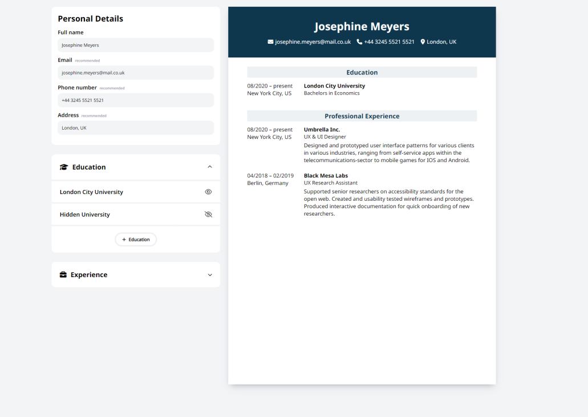

# <a href="https://a07k.github.io/project-cv/">Project - CV</a>

<h2>Description</h2>

Project CV is a React-based web application that allows users to create and customize their resume/CV online. It provides an intuitive interface for inputting personal details, education, and work experience, with real-time preview of the resume.

<h2>Features</h2>

<ul>
  <li>Personal information input</li>
  <li>Add multiple education and experience entries</li>
  <li>Collapsible sections for easy editing</li>
  <li>Hide/show specific entries</li>
  <li>Real-time resume preview</li>
  <li>Customizable resume layout</li>
  <li>Template loading and clearing functionality</li>
</ul>

<h2>Project Structure</h2>

<pre><code>project-cv/
├── src/
│   ├── components/
│   │   ├── personal-info/
│   │   │   └── PersonalDetails.js
│   │   ├── education/
│   │   │   └── AddEducationSection.js
│   │   ├── experience/
│   │   │   └── AddExperienceSection.js
│   │   ├── Resume.js
│   │   ├── TemplateLoader.js
│   │   ├── Sidebar.js
│   │   └── Customize.js
│   ├── styles/
│   │   └── App.css
│   ├── App.js
│   ├── example-data.js
│   └── index.js
├── public/
│   └── index.html
├── package.json
└── README.md
</code></pre>

<h2>Technologies Used</h2>

<ul>
  <li>React</li>
  <li>JavaScript (ES6+)</li>
  <li>CSS</li>
  <li>uniqid (for generating unique IDs)</li>
</ul>

<h2>Setup and Installation</h2>

<ol>
  <li>Clone the repository:
    <pre><code>git clone https://github.com/your-username/project-cv.git</code></pre>
  </li>
  <li>Navigate to the project directory:
    <pre><code>cd project-cv</code></pre>
  </li>
  <li>Install dependencies:
    <pre><code>npm install</code></pre>
  </li>
  <li>Start the development server:
    <pre><code>npm start</code></pre>
  </li>
  <li>Open your browser and visit <code>http://localhost:3000</code></li>
</ol>

<h2>Usage</h2>

<ol>
  <li>Fill in your personal details in the Personal Information section.</li>
  <li>Add your education history using the Education section.</li>
  <li>Input your work experience in the Experience section.</li>
  <li>Use the Customize tab to change the resume layout.</li>
  <li>View your resume in real-time on the right side of the screen.</li>
  <li>Use the Template Loader to load example data or clear the form.</li>
</ol>

<h2>Contributing</h2>

Contributions are welcome! Please feel free to submit a Pull Request.

<h2>License</h2>

This project is open source and available under the <a href="LICENSE">MIT License</a>.

